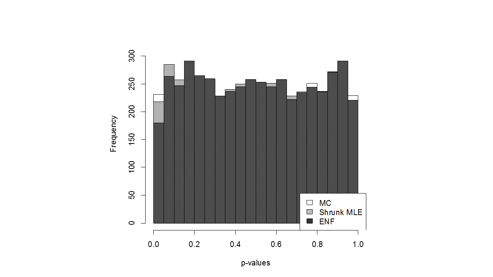
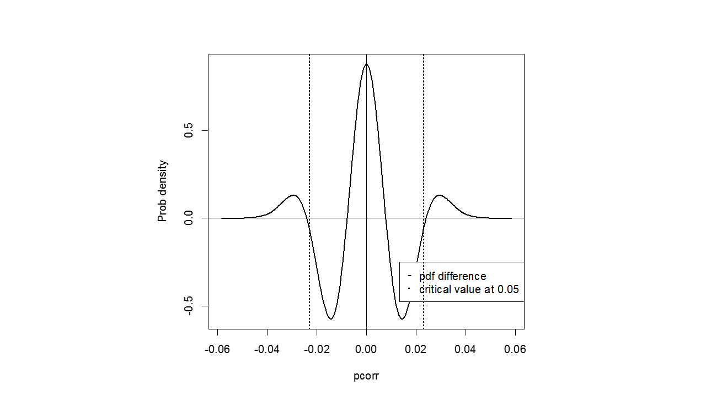

# GGM-Shrinkage
This script reproduces the results in 
  * Title: EXACT HYPOTHESIS TESTING FOR SHRINKAGE BASED GGM 
  * Authors            : Victor Bernal*, Rainer Bischoff, Victor Guryev, Marco Grzegorczyk, Peter Horvatovich
  * Date created      : 2018-11-15
  * Submitted to Bionformatics Journal

Update history : 2019- 03-09

Please cite this paper when you have used it in your publications. 

Prerequisite 
requires R libraries (CRAN): "GeneNet" , "stats4", "ggplot2", and "Hmisc".

# Description
 The aim is to show that the reconstruction of (shrinkage based) GGMs is biased
 unless the shrinkage parameter is included in the inference. 
 To illustrate thi we will highlight that with the new shrunk density 
 (i) p values are correctly distributed i.e. uniform [0 1] under the null hypothesis: no partial correlation
 (ii) expected false positives rate are accurate controlled
 (iii) the positive predicted values is superior
 As gold standard we will use the computationally expensive Monte Carlo estimation 

GitHUB-GGM_ Shrinkage_v2.R is the R script that reproduces all the analysis.
shrinkagefunctions.R is the source file with the implementation (i.e. R functions).

# How to use it the functions?
p= number of variables (e.g. genes)   
n= number of data points 

Simulate a GGM with a percentage (etaA) of non-zero edges  
    sim.pcor<-ggm.simulate.pcor(p, etaA)  
    Simulate data of length n   
    sim.data<- ggm.simulate.data( n , sim.pcor)   
Reconstruct the GGM from the data with the optimal shrinkage (lambda)  
    GGM <- pcor.shrink(sim.data, verbose=TRUE)   
    lambda<-attr(GGM, "lambda")   
    r<-sm2vec(GGM)  
Compare p-values for each edge with   
Our method (Shrunk MLE)  
    p.shrunk( r, p ,n , lambda)  
Monte Carlo (MC, the goldstandard)     
    p.montecarlo( r, number, p , n ,lambda)  
Empirical null fitting (currently implemented in GeneNet 1.2.13)  
    network.test.edges(GGM, fdr=TRUE, plot=FALSE)  

# Figures
The p- values from Empirical null fitting are biased (not uniform).The standard prob density minus the "shrunk" density (larger tails=> more false positives) 

Comparison Positive Predictive Values  (superior Shrunk MLE, agrees with the gold standard) 

